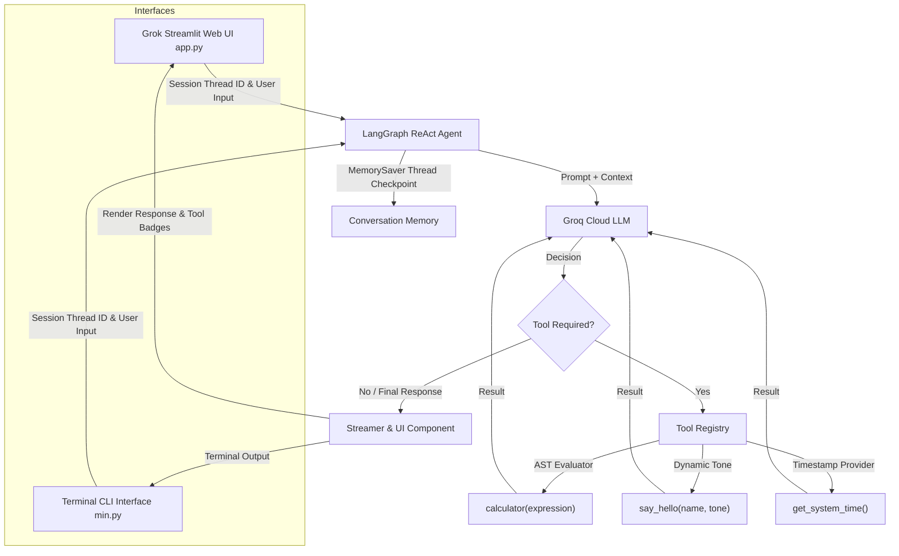

# Grok AI Chatbot & ReAct Agent

A high-performance, multi-turn AI assistant ecosystem powered by **LangGraph**, **LangChain Core**, **Groq Cloud API**, and **Streamlit**. It features both a sleek **Grok 3 / xAI-inspired Web UI** (`app.py`) and an interactive **Terminal CLI** (`min.py`).

---

## 📌 Features

- ⚡ **Ultra-Fast LLM Inference**: Powered by Groq Cloud (e.g., `qwen/qwen3.6-27b`, `groq/compound`, `groq/compound-mini`, `openai/gpt-oss-120b`, `openai/gpt-oss-20b`, or custom model identifiers).
- 𝕏 **Grok-Inspired Web UI (`app.py`)**:
  - Obsidian dark design system with glassmorphism and elevated card styling (`#09090b` / `#141417`).
  - Interactive **Tool Execution Visualizer** showing live tool call inputs and structured outputs.
  - Dynamic model selector, custom model string input, and creativity temperature slider (`0.0` - `1.0`).
  - Toggleable tool ecosystem (selectively enable/disable individual tools).
  - Multi-session chat history manager (create, switch between, and persist conversation threads).
  - Quick-start interactive prompt cards for math formulas, time checks, and greetings.
  - Live API key configuration and status indicator.
  - Customizable system prompt persona editor.
- 🧠 **Multi-Turn Conversational Memory**: LangGraph `MemorySaver` checkpointer preserves thread state across multi-turn queries.
- 🛠️ **Integrated Tool Ecosystem**:
  - `calculator`: Safe AST-based mathematical expression evaluator (supporting arithmetic, roots, trigonometry, logarithms, constants like $\pi$ and $e$, with zero `eval` vulnerability).
  - `say_hello`: Adaptive greeting tool supporting customizable tones (*friendly*, *formal*, *energetic*, *casual*).
  - `get_system_time`: Real-time local and UTC timestamp provider.
- 💻 **Rich Terminal CLI (`min.py`)**:
  - ANSI-styled interface with color-coded prompts and tool execution badges.
  - Direct interactive commands: `help`, `clear`, `reset`, `model`, `quit`.

---

## 🏗️ Architecture



---

## 📂 Project Structure

```
projectt/
├── .env                # Environment variables (API keys, model configs)
├── .env.example        # Template for required environment variables
├── .gitignore          # Git ignore rules
├── app.py              # Grok-inspired Streamlit Web Application
├── min.py              # Main agent definition, tools, and CLI application
├── requirements.txt    # Python project dependencies
└── README.md           # Project documentation & usage guide
```

---

## 🚀 Getting Started

### 1. Prerequisites
- **Python 3.10+** installed.
- A **Groq API Key** (Get a free key at [console.groq.com](https://console.groq.com/keys)).

### 2. Virtual Environment Setup

Activate the `.venv` virtual environment:

#### Windows (PowerShell):
```powershell
.\.venv\Scripts\Activate.ps1
```

#### Windows (CMD):
```cmd
.\.venv\Scripts\activate.bat
```

#### macOS / Linux:
```bash
source .venv/bin/activate
```

### 3. Install Dependencies

All dependencies are defined in `requirements.txt`:

```bash
pip install -r requirements.txt
```

### 4. Configure Environment Variables

Create or configure `.env` in the root directory:

```env
GROQ_API_KEY=gsk_your_groq_api_key_here
GROQ_MODEL=qwen/qwen3.6-27b
```

---

## 🖥️ Running the Applications

### Option A: Grok Streamlit Web UI (Recommended)

To launch the web application:

```powershell
python -m streamlit run app.py
```

Or using virtual environment directly:

```powershell
.\.venv\Scripts\streamlit.exe run app.py
```

Open your browser at **`http://localhost:8501`**.

---

### Option B: Terminal CLI Interface

To start the interactive command-line interface:

```powershell
python min.py
```

#### CLI Quick Commands:

| Command | Action |
|---|---|
| `help` | Display command guidance and tool info |
| `clear` / `cls` | Clear terminal console screen |
| `reset` / `new` | Reset memory and start a new conversation session |
| `model` | Inspect active model name, API key status, and session ID |
| `quit` / `exit` / `q` | Exit the CLI application |

---

## 💬 Usage & Tool Examples

### 1. Mathematical Calculations
```text
Query: "Calculate sqrt(144) + 10^2 * sin(pi/4)"
Tool: calculator(expression='sqrt(144) + 10**2 * sin(pi/4)')
Result: 82.71067811865476
```

### 2. Personalized Tone Greetings
```text
Query: "Greet Alex in an energetic tone"
Tool: say_hello(name='Alex', tone='energetic')
Result: "Hey Alex! Super excited to collaborate with you! Let's get things done!"
```

### 3. System Time Lookup
```text
Query: "What is the current system time?"
Tool: get_system_time()
Result: "Local Time: Friday, August 21, 2026 - 10:45:00 AM | UTC Time: 2026-08-21 05:15:00 UTC"
```
