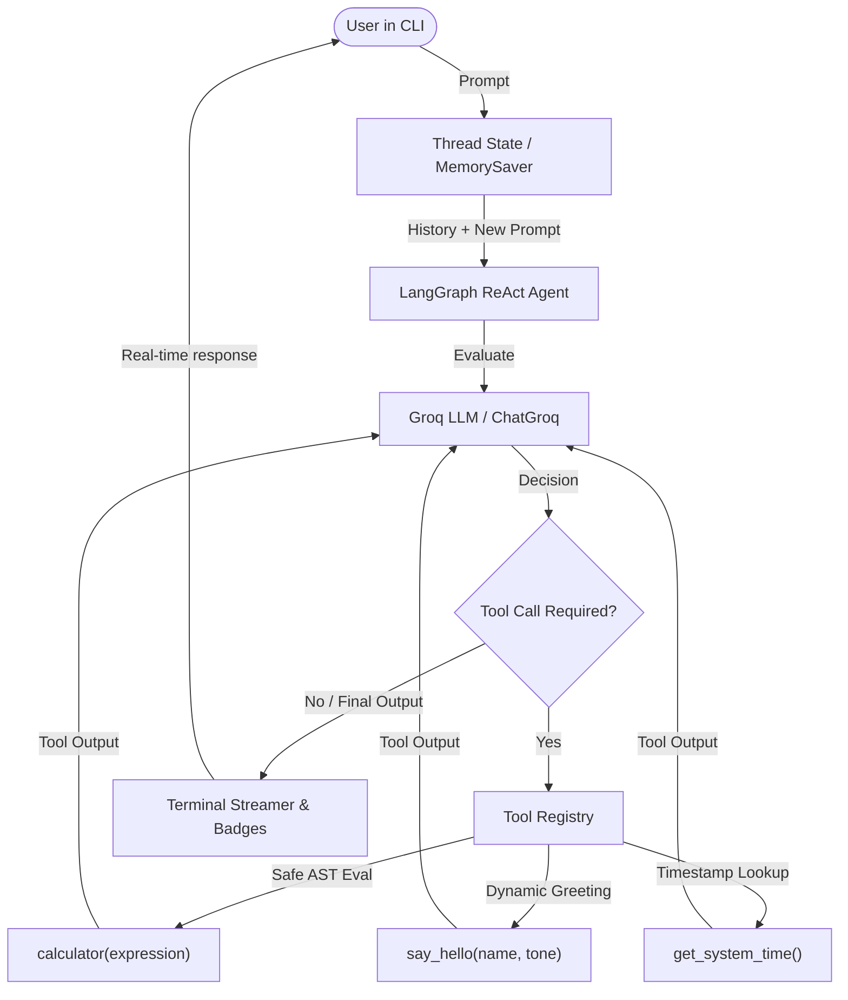

# Python AI Chatbot (ReAct Agent with LangGraph & Groq)

A high-performance, multi-turn AI assistant built with **LangGraph**, **LangChain Core**, and **Groq Cloud API**. It employs the **ReAct (Reasoning + Acting)** framework with stateful thread memory (`MemorySaver`), safe mathematical evaluation, and a rich, interactive CLI experience.

---

## 📌 Features

- ⚡ **Ultra-Fast LLM Inference**: Powered by Groq Cloud (e.g., `qwen/qwen3.6-27b`, `llama-3.3-70b-versatile`).
- 🧠 **Multi-Turn Conversational Memory**: Uses LangGraph's `MemorySaver` checkpointer with thread sessions to preserve full conversational history across turns.
- 🛠️ **Integrated Tool Ecosystem**:
  - `calculator`: Safe AST-based mathematical expression evaluator (supporting arithmetic, roots, trigonometry, logs, constants like $\pi$ and $e$, without unsafe `eval`).
  - `say_hello`: Adaptive greeting tool with custom tones (*friendly*, *formal*, *energetic*, *casual*).
  - `get_system_time`: Real-time local and UTC timestamp provider.
- 🎨 **Rich Terminal UX**:
  - ANSI-styled interface with glowing prompts and banners.
  - Real-time tool execution tracking (`⚡ Calling Tool` & `⚙️ Tool Output`).
  - Interactive commands: `help`, `clear`, `reset`, `model`, `quit`.
- 🛡️ **Robust Error Handling**: Graceful recovery from API connection hiccups, rate limits, and `Ctrl+C` termination.

---

## 🏗️ Architecture



---

## 📂 Project Structure

```
projectt/
├── .env                # Environment variables (API keys, model configs)
├── .env.example        # Template for required environment variables
├── .gitignore          # Git ignore rules for Python, virtual environments, .env
├── min.py              # Main application entry point, agent definition & tools
├── reqirements.txt     # Python project dependencies
└── README.md           # Project documentation & usage guide
```

---

## 🚀 Getting Started

### 1. Prerequisites
- **Python 3.10+** installed.
- A **Groq API Key** (Get one free at [console.groq.com](https://console.groq.com/keys)).

### 2. Set Up Virtual Environment

```bash
# Create a virtual environment
python -m venv .venv

# Activate the virtual environment
# On Windows (PowerShell):
.venv\Scripts\Activate.ps1
# On Windows (CMD):
.venv\Scripts\activate.bat
# On macOS / Linux:
source .venv/bin/activate
```

### 3. Install Dependencies

```bash
pip install -r reqirements.txt
```

### 4. Configure Environment Variables

Create or edit `.env`:

```env
GROQ_API_KEY=gsk_your_groq_api_key_here
GROQ_MODEL=qwen/qwen3.6-27b
```

### 5. Run the Application

```bash
python min.py
```

---

## ⌨️ CLI Commands

While chatting, you can enter any of the following commands:

| Command | Action |
|---|---|
| `help` | Display command help and tool overview |
| `clear` / `cls` | Clear the terminal screen and display the banner |
| `reset` / `new` | Reset conversation memory and start a fresh session thread |
| `model` | Inspect active model name, API key status, and session ID |
| `quit` / `exit` / `q` | Cleanly exit the chatbot |

---

## 💬 Usage Examples

### 1. Advanced Safe Math
```text
You > What is sqrt(144) + 15 * 4 - 2^3?
⚡ Calling Tool: calculator(expression='sqrt(144) + 15 * 4 - 2**3')
⚙️  [calculator]: Calculation Result: sqrt(144) + 15 * 4 - 2**3 = 64.0
Assistant > The result of the calculation is **64.0**.
```

### 2. Multi-turn Memory
```text
You > My favorite color is electric indigo.
Assistant > That is a vibrant and striking color! I've noted that your favorite color is electric indigo.

You > What is my favorite color again?
Assistant > Your favorite color is electric indigo!
```

### 3. Dynamic Greetings & System Timestamps
```text
You > Greet Sophia in an energetic tone and tell me what time it is.
⚡ Calling Tool: say_hello(name='Sophia', tone='energetic')
⚡ Calling Tool: get_system_time()
⚙️  [say_hello]: Hey Sophia! Super excited to collaborate with you! Let's get things done!
⚙️  [get_system_time]: Local Time: Thursday, August 20, 2026 - 10:42:00 AM | UTC Time: 2026-08-20 05:12:00 UTC
Assistant > Hey Sophia! Super excited to collaborate with you! Let's get things done! The current time is Thursday, August 20, 2026 at 10:42 AM.
```
